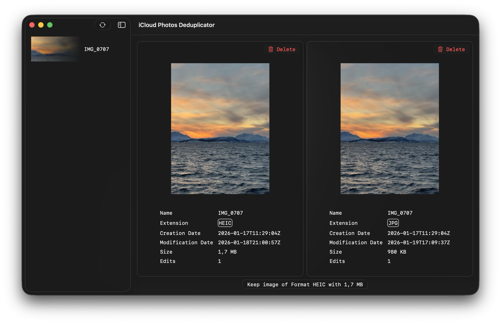

# `ipd` — iCloud Photos Deduplicator

`ipd` is a small macOS utility application that tries to detect images with the same name, same creation date and type. It's meant to help out the iCloud Photos Duplicate finder, as it sometimes misses obvious clones, `ipd` only looks for obvious ones.

## How it works
- The application fetches all your photos and videos, and checks if multiple ones have the same name and creation date.
- If duplicates are found, you can delete the one that is of lesser quality and keep your library a bit cleaner than you found it.

Note: Please check if it really is the same image, if one of them is edited it may still show up as a duplicate, don't delete it then :)

## Build & Run
1. Clone the repo.
2. Change the `DEVELOPMENT_TEAM` value in `project.yml`
3. Run `xcodegen generate`
4. Open Xcode, build and run the application
4. On first launch, grant Photos permission when prompted.

## Privacy
All processing occurs on-device. Photos access is only used to read metadata and delete items the user confirms. The app does not upload your photos.
